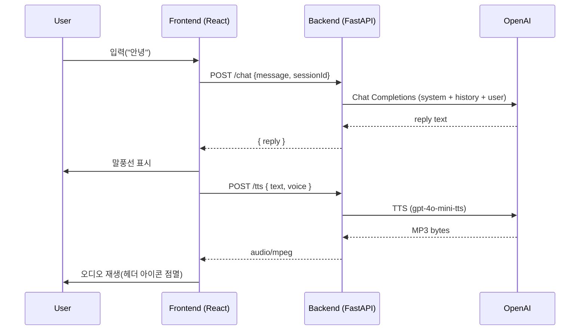

# LumaTalk – Architecture & Diagrams

모바일 웹 프론트(React+Vite)와 FastAPI 백엔드(OpenAI Chat/TTS 프록시)로 구성된 서비스입니다.

## System Architecture (Mermaid)

```mermaid
flowchart TD
  subgraph Client[User Device]
    UI[Mobile Web UI<br/>React + Vite<br/>Render Static Site]
  end

  subgraph Frontend[Frontend]
    Static[Static Assets<br/>(index.html, JS, CSS, PNG)]
  end

  subgraph Backend[Backend]
    API[FastAPI (Render Web Service)<br/>Endpoints: /, /health, /chat, /tts<br/>CORS: lumatalk-1.onrender.com, localhost]
    OpenAI[(OpenAI APIs<br/>Chat Completions<br/>TTS gpt-4o-mini-tts)]
  end

  subgraph External[External SDK]
    Kakao[Kakao Maps SDK (client-side)]
  end

  UI -->|GET static| Static
  UI -->|POST /chat| API
  UI -->|POST /tts| API
  API -->|Chat + TTS calls| OpenAI
  UI -.-> Kakao
```

## Chat + TTS Sequence (Mermaid)



## Deployment
- Frontend: Render Static Site
  - Build: `npm ci && npm run build`
  - Publish Dir: `dist`
  - Env: `VITE_API_URL=https://lumatalk.onrender.com`
- Backend: Render Web Service
  - Root Dir: `backend`
  - Build: `pip install -r requirements.txt`
  - Start: `uvicorn main:app --host 0.0.0.0 --port $PORT`
  - Env: `OPENAI_API_KEY`, `OPENAI_MODEL=gpt-4o-mini`

## Notes
- Free 플랜 콜드스타트로 처음 요청이 느릴 수 있습니다.
- 세션 히스토리는 메모리에 저장되므로 재시작/슬립 후 초기화됩니다.
